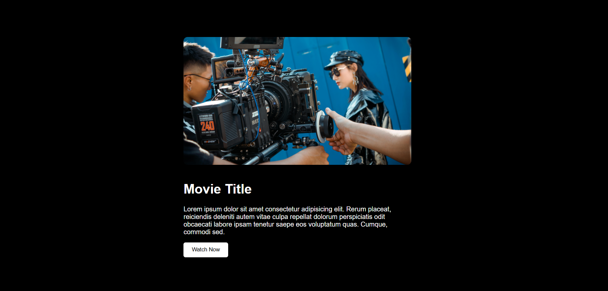

# 🎬 Video Trailer Popup

This is a simple project that plays a **YouTube-style trailer popup** using HTML, CSS, and JavaScript. When the user clicks the "Play" button, a video trailer pops up in a modal and plays automatically.

## 🔗 Live Demo

👉 [Click here to see the live site](https://kumar-veerendra.github.io/video-trailer-popup)

## 📸 Screenshot



## 🧰 Tech Stack

- **HTML5**
- **CSS3**
- **JavaScript (Vanilla)**
- GitHub Pages (for hosting)

## 🚀 Features

- Popup modal video player
- Auto-play on popup open
- Closes the modal and stops video playback
- Mobile responsive

## 📁 Project Structure

```
Video-Trailer/
├── index.html         # Main HTML page
├── style.css          # Styling for the page and popup
├── script.js          # JavaScript to handle popup logic
├── trailer.mp4        # Local video file used for the popup
└── screenshot.png     # Screenshot for preview
```

## 👨‍💻 How to Run Locally

```bash
git clone https://github.com/kumar-veerendra/Video-Trailer.git
cd Video-Trailer
open index.html in your browser
```

## 🌐 Deployment

This project is deployed using **GitHub Pages**.  
Deployed from the `main` branch, with the root directory as source.

## 📜 License

MIT License

---

